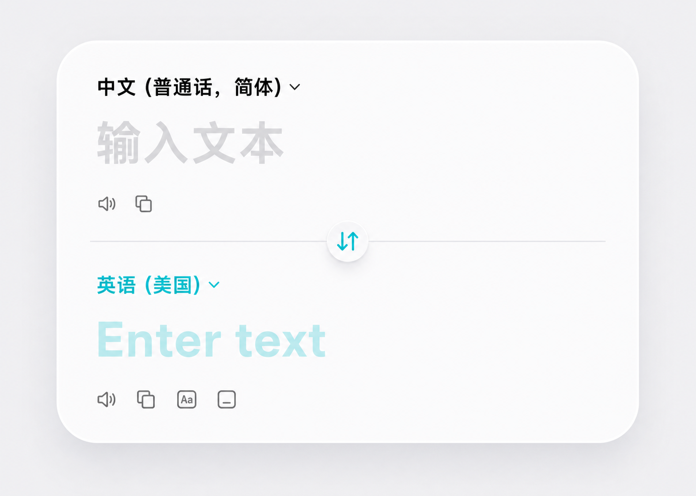

# 0000 Timeline

This timeline starts the project memory for VibeCopy's floating translation island. It captures the design direction, decisions, references, and known implementation gaps from the current conversation.

## 2026-05-05 - Soft White Single-Panel Direction

The current goal is to redesign the VibeCopy floating translation island toward a soft white frosted UI with a single continuous panel. The desired feel is closer to an iOS/macOS translation input surface: milky white, soft shadow, large radius, restrained borders, and calm low-contrast controls.

Accepted target direction:

### Decisions

- Use one continuous large rounded white container, not separate stacked cards.
- Split the container into upper and lower sections with one thin horizontal divider line.
- Keep the divider shorter than the container width, leaving modest inset on both sides.
- Place the swap control as a small circular button centered on the divider.
- Put each language selector at the top-left of its own section.
- Do not show right-side microphone buttons.
- Keep the upper-section speaker and copy actions in the lower-left area of the upper section.
- In the lower section, hide the action row while there is no translated content.
- After translation content exists, show lower-section actions for:
  - speak result
  - copy result
  - copy as camelCase
  - copy as snake_case
- Icon visuals can be improved later; current priority is the layout and panel structure.

### Current Gaps

- Direct text input is not implemented yet.
- Some buttons are visual or partially wired and still need complete behavior.
- The lower-section action visibility needs to depend on actual translation content.
- The final icon set still needs polish after the layout is locked.

### Implementation Notes

- The archive should preserve generated mockups and conversation images as repo artifacts under `changelog/assets/`.
- Future entries should continue this file chronologically, adding images and decision notes as the design evolves.

## 2026-05-05 - Single-Panel Layout Implemented

The WebUI layout was changed from three visually separate sections into one continuous translation panel. The source language, source placeholder/content, divider, swap button, target language, target placeholder/content, and action rows now live inside one shared rounded white container.

### Implemented

- Replaced the separate source card, language strip, and result card with a single `translation-panel`.
- Moved source language selection to the upper-left of the upper section.
- Moved target language selection to the upper-left of the lower section.
- Added a shorter centered divider line with modest side insets.
- Centered the circular swap button on the divider.
- Removed right-side microphone buttons from the target layout.
- Kept source speak/copy actions in the lower-left of the upper section.
- Hid lower result actions by default; they now show only when a translation result exists.

### Still Open

- Direct typing into the panel is not implemented.
- Language selection and swap controls are still visual placeholders.
- The action icons are functional where already wired, but their visual design still needs polish.

## 2026-05-05 - Visual Match Pass

The first single-panel implementation was still too different from the approved mockup: it appeared too wide and flat, retained the old toolbar row above the panel, and browser-native button styling made the language chevrons appear inside square button chrome.

### Adjusted

- Hid the WebUI toolbar row so the panel can occupy the same visual role as the mockup.
- Added `appearance: none` for buttons to remove native WebKit button chrome.
- Increased panel height and radius within the current island window.
- Increased shell side padding so the panel reads less wide and closer to the mockup proportions.
- Enlarged language labels and placeholder typography.
- Moved action rows inward to match the mockup's left-lower placement.

### Still Open

- Further tuning may require changing the native island window size, not just CSS, if the design should become taller than the current 680x410 surface.

## 2026-05-05 - Input and Button Wiring Pass

The panel moved from a mostly static visual mockup toward an interactive translation surface.

### Implemented

- Restored the top toolbar as a lightweight floating row instead of hiding it.
- Disabled toolbar icons that do not yet have defined behavior, while keeping the pin action active.
- Replaced native-looking language chevrons with inline SVG chevrons.
- Removed the circular background from the center swap control; the cyan swap icon now sits directly on the divider.
- Changed the upper source area from static text to an editable text area.
- Added WebUI messages for source text changes, manual translation, and language swapping.
- Connected typed input to the existing `TranslationService`.
- Added source/target language direction support to `TranslationService`.
- Kept source speak/copy actions wired to the current input text.
- Kept result speak/copy/camelCase/snake_case actions wired to the translated result.
- Result actions stay hidden until a translation result exists.

### Still Open

- Full language selection menus are not implemented; this pass keeps fixed Chinese/English swapping.
- Top toolbar actions beyond pin are intentionally disabled until their behavior is defined.
- Icon artwork still needs a dedicated visual polish pass.

## 2026-05-05 - Remove Inner Frame and Fix Input Focus

The previous pass still showed an unwanted inner panel frame and the text area could not reliably receive keyboard input.

### Adjusted

- Removed the inner `glass-card` wrapper from the WebUI translation panel so content sits directly on the native island surface.
- Changed the native island window from a non-activating panel to a key-capable custom panel so WebView text input can receive focus.
- Set the WebView as first responder when the island opens.
- Auto-focused the source text area in empty state.
- Shifted content alignment closer to the accepted design reference.
- Updated action icons toward the reference style, especially copy/camelCase/snake_case.

### Still Open

- Toolbar and action icon artwork may still need a final dedicated matching pass.

## 2026-05-05 - Icon Clarity Pass

The icon set was still too heavy and blurry compared with the accepted design reference.

### Adjusted

- Reduced global SVG stroke weight and enabled geometric SVG rendering.
- Tightened language chevron spacing so it sits closer to the language label.
- Reworked toolbar icons with thinner, cleaner paths.
- Reworked speaker and copy icons toward the reference style.
- Reworked the center swap icon path and restored the small circular float surface with a cleaner, thinner glyph.
- Reduced action icon visual weight while keeping hit areas usable.

### Still Open

- A final pass may replace all inline SVGs with one consistent icon system if exact matching is required.

## 2026-05-05 - Icon Interaction and Contrast Pass

The icon system still felt too blurry and too light, and click/hover effects produced unwanted blocky backgrounds.

### Adjusted

- Removed block-style hover and active backgrounds from toolbar and action icons.
- Removed the dark active state from the pin icon; active feedback is now color-only.
- Reduced icon stroke weight again while increasing icon color contrast.
- Increased toolbar icon size slightly and tightened the toolbar interaction rules.
- Kept the language chevrons close to the language labels with darker, finer strokes.
- Kept the swap control's round surface, but reduced glyph stroke weight for a cleaner look.

### Still Open

- If the inline SVGs still do not match the reference, the next step should be replacing the whole set with a single curated symbol set rather than continuing one-off path edits.

## 2026-05-05 - Reusable Icon System Pass

The previous icon polish still mixed user-provided iconfont-style SVGs with one-off inline stroked SVGs, which made the toolbar and action icons feel inconsistent.

### Adjusted

- Added a project icon style guide at `docs/icon-style.md`.
- Preserved the user-provided pin and settings SVGs as reusable assets in `Resources/WebUI/icons/`.
- Standardized toolbar, action, chevron, and swap symbols as reusable SVG files under `Resources/WebUI/icons/`.
- Removed inline SVG usage from `Resources/WebUI/index.html`.
- Switched the WebUI to render icons through CSS masks so every symbol uses the same `currentColor` pipeline.
- Tightened the language chevron spacing and increased icon contrast to avoid the previous blurry/light appearance.

### Still Open

- The business behavior of the disabled toolbar placeholders still needs future definition.
- Exact icon artwork can keep improving, but future changes should replace reusable SVG assets instead of editing inline markup.

## 2026-05-05 - SVG Mask Fallback Fix

The reusable icon pass introduced a WKWebView rendering bug: local SVG mask URLs could fail to resolve, causing every icon to disappear while button layout remained visible.

### Adjusted

- Replaced CSS mask icon rendering with direct reusable SVG file loading through ``.
- Kept every symbol as a standalone asset in `Resources/WebUI/icons/`.
- Updated `docs/icon-style.md` to document the WebKit mask limitation and the direct SVG loading rule.
- Kept icon sizing, opacity, and cyan swap/target chevron treatment in CSS.

## 2026-05-05 - Unified Stroke Icon Redraw

The icon files were reusable, but the artwork still mixed complex user-provided filled paths with simple temporary line icons.

### Adjusted

- Redrew the pin and settings icons into the same stroke-based visual weight as the rest of the set while preserving their reference silhouettes.
- Redrew toolbar and action icons on a shared 1024 grid with consistent stroke width, caps, joins, and optical bounds.
- Tuned icon sizes and opacity in CSS so toolbar, language chevrons, action icons, and the center swap icon feel closer to one family.
- Updated `docs/icon-style.md` to treat the current set as a unified stroke icon system rather than a mixed iconfont/stroke set.

## 2026-05-05 - Internal Icon Family Reset

The hand-drawn SVG rewrite still did not produce a polished, unified icon family, and external attribution notes were introduced without being part of the product direction.

### Adjusted

- Removed the external attribution note from `Resources/WebUI/icons/`.
- Kept all icons as local reusable, project-owned SVG files under `Resources/WebUI/icons/`.
- Updated `docs/icon-style.md` to state that the icon language is internally drawn.
- Kept the rightmost toolbar settings symbol aligned with the reference design's slider/settings metaphor.
- Retuned icon sizes and chevron spacing for the floating panel.

## 2026-05-05 - Document Icon Removal and Gear Settings Pass

The toolbar still carried an extra document/note placeholder and the settings symbol needed to match the gear reference.

### Adjusted

- Removed the document/note toolbar button from the WebUI.
- Deleted `Resources/WebUI/icons/document.svg`.
- Redrew the remaining local SVG icons with a lighter, more consistent self-drawn stroke.
- Changed `settings.svg` to a gear outline matching the latest reference direction.
- Updated `docs/icon-style.md` to remove the document icon from the current set.

## 2026-05-05 - Build-Time Inline SVG Injection Pass

The icon direction was clarified: each icon should remain an independent SVG source file, while runtime rendering should still get the benefits of inline SVG and `currentColor`.

### Adjusted

- Added `Resources/WebUI/index.template.html` as the editable WebUI template.
- Added `scripts/build-webui-icons.mjs` to inject SVG files into `Resources/WebUI/index.html` at build time.
- Updated `scripts/build-app.sh` to run the icon injection script before packaging.
- Kept one SVG source file per icon under `Resources/WebUI/icons/`.
- Changed all icon SVGs to `stroke="currentColor"` and a unified `stroke-width="1.6"`.
- Redrew `pin.svg` as a cleaner non-deformed pushpin.
- Kept the document icon removed.

## 2026-05-05 - Unified Icon Geometry Pass

The icon set still had uneven optical sizes and mixed shape complexity. Some symbols felt heavy, some felt thin, and CSS carried one-off size exceptions that made the family drift apart.

### Adjusted

- Redrew the current SVG set around a shared 24px coordinate system, 1.75px stroke, round caps, and similar optical bounds.
- Replaced the complex gear settings icon with a simpler slider-settings symbol matching the rest of the line family.
- Normalized toolbar, action, chevron, and swap icon sizing in CSS and removed per-icon size overrides.
- Kept build-time inline SVG injection as the rendering path so icons still inherit `currentColor`.

## 2026-05-05 - Reference-Light Icon Pass

The icon set was still too heavy compared with the intended macOS-style reference, especially copy, text-case, and pin.

### Adjusted

- Reduced the shared icon stroke from 1.75px to 1.45px, keeping only the small chevron slightly reinforced.
- Redrew `copy.svg` with cleaner overlapping rounded rectangles closer to the reference.
- Redrew `text-case.svg` as a lighter rounded-square `Aa` symbol.
- Redrew `pin.svg` with a simpler, narrower outline and less visual mass.

## 2026-05-05 - Reference Icon Redraw Correction

The first reference-light pass was too subtle and still looked like incremental path edits instead of a true redraw.

### Adjusted

- Rebuilt `copy.svg` as two clean rounded rectangles with the same overlap and spacing language as the reference.
- Rebuilt `text-case.svg` around a clear boxed `Aa` mark instead of the previous cramped letter construction.
- Simplified `pin.svg` further and removed decorative arrow shaping so it reads as a quiet toolbar symbol.
- Reduced action icon display size slightly so the thin-line shapes match the reference weight at runtime.

## 2026-05-06 - Fix Translation Island Flash and Close Animation

The floating translation island had two rendering bugs on open: a double-flash caused by the window rendering before SwiftUI had painted, and a white rectangle artifact in the lower-right region caused by an internal NSScrollView background.

### Fixed

- Eliminated the open double-flash by setting `islandModel.phase = .opened` directly (no intermediate `.closed` state) and using `NSAnimationContext` to fade the window in from `alphaValue=0` over 0.2s. The previous approach rendered a pill frame before expanding, which appeared as two visible flashes.
- Replaced `showWindow(nil)` and `setFrame(display:true)` with `orderFrontRegardless()` and `setFrame(display:false)` to prevent AppKit from compositing the window before SwiftUI has painted its first frame.
- Added close animation: `phase=.closed` triggers the SwiftUI collapse animation while `NSAnimationContext` fades `alphaValue` to 0 over 0.25s, then calls `orderOut` and resets `alphaValue=1` for the next open.
